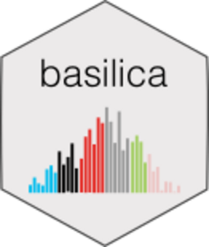

# BASCULE <a href="https://caravagnalab.github.io/bascule/"></a>

BASCULE is a Bayesian model to fit multiple signature types from multiple patients, leveraging a pre-existing catalogue of known signatures such as COSMIC. BASCULE searches for known signatures from the input catalogue as well as for new signatures that outside the catalogue, accounting for hidden structure in the input data (e.g., distinct tumour types). Moreover, bascule performs tensor clustering to retrieve latent groups in the input cohort from the exposures of multiple signature types jointly. The model uses non-negative matrix factorisation and variational inference implemented in the [pybascule](https://github.com/caravagnalab/pybascule) Python package. 

#### Citation

[](https://doi.org/10.1101/2024.09.16.613266)

If you use `bascule`, please cite:

-   E. Buscaroli, A. Sadr, R. Bergamin, S. Milite, E. N. Villegas Garcia, A. Tasciotti, A. Ansuini, D. Ramazzotti, N. Calonaci, G. Caravagna. A Bayesian framework to infer and cluster mutational signatures leveraging prior biological knowledge. [bioRxiv preprint](https://www.biorxiv.org/content/10.1101/2024.09.16.613266v1), 2024.

#### Help and support

[](https://caravagnalab.github.io/bascule)

### Installation

You can install the released version of `bascule` from
[GitHub](https://github.com/) with:

``` r
# install.packages("devtools")
devtools::install_github("caravagnalab/bascule")
```

------------------------------------------------------------------------

#### Copyright and contacts

Elena Buscaroli, Azad Sadr, Giulio Caravagna. Cancer Data Science (CDS) Laboratory,
University of Trieste, Italy.

[](https://github.com/caravagnalab)
[](https://www.caravagnalab.org/)
