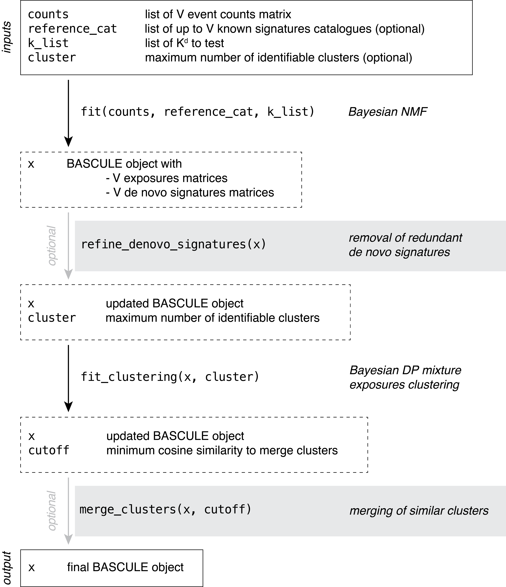
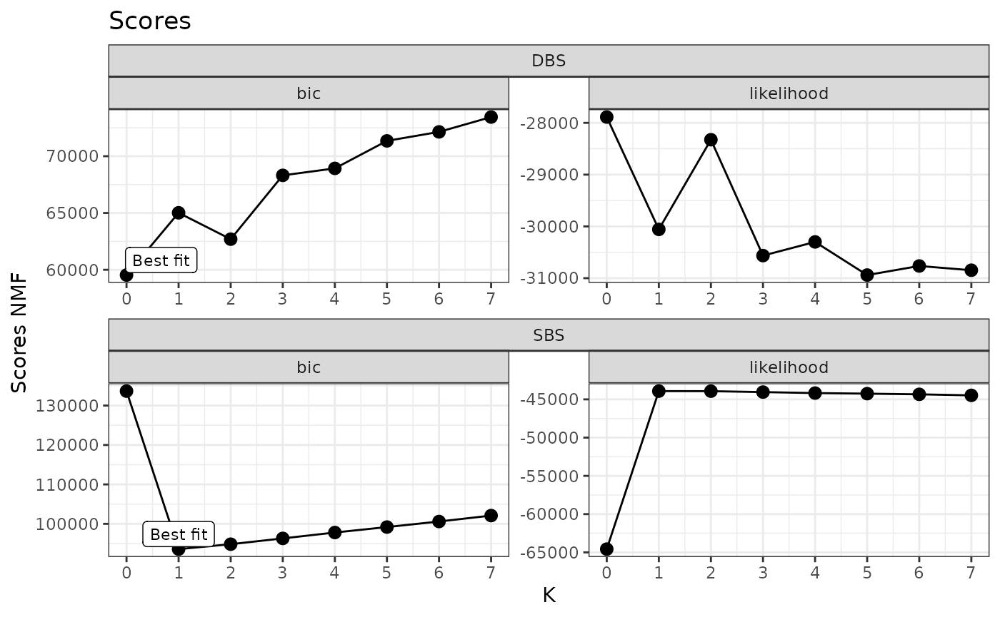
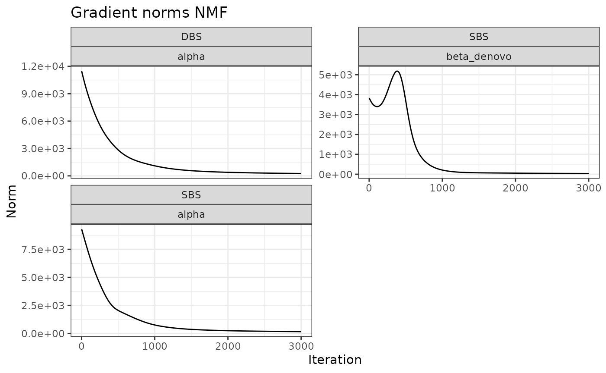
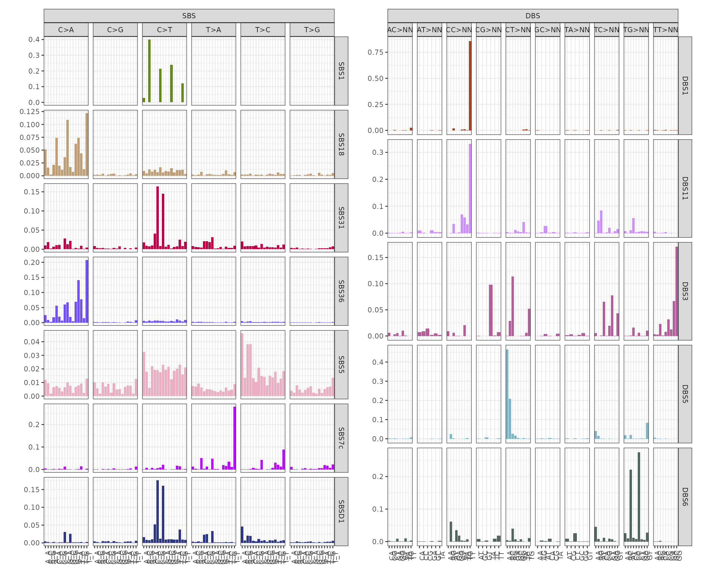
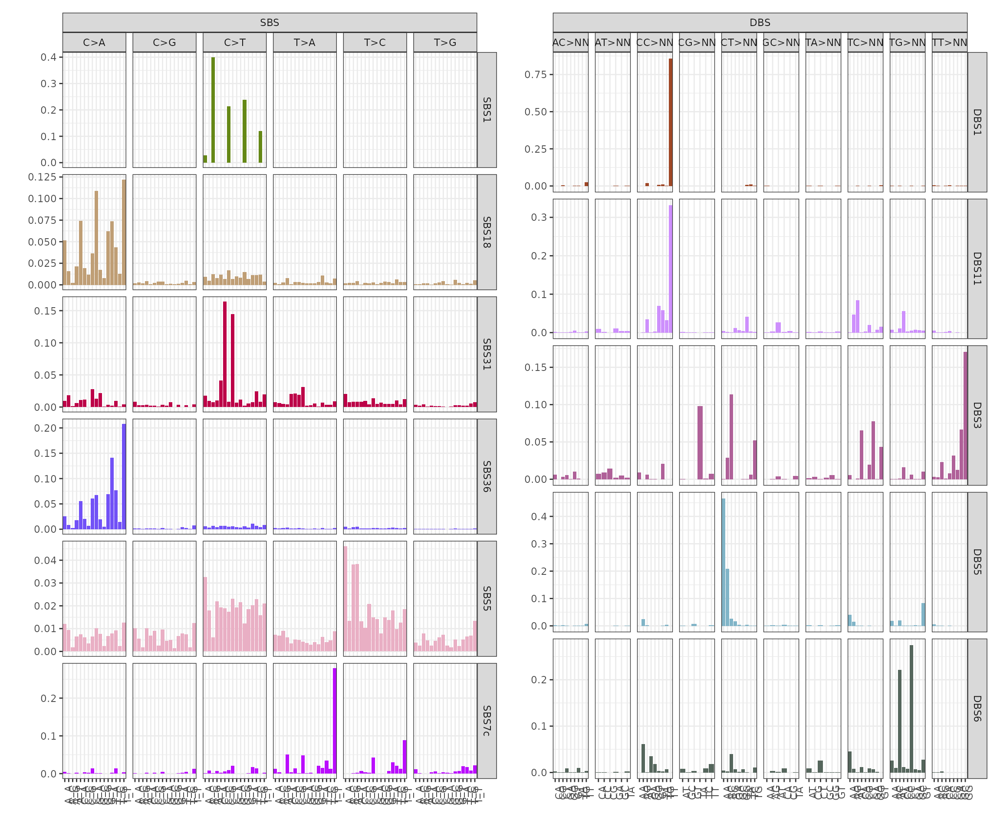
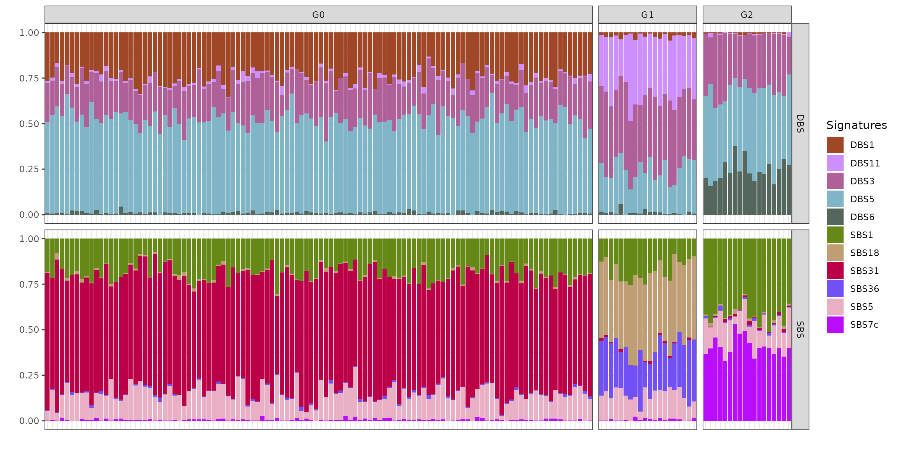
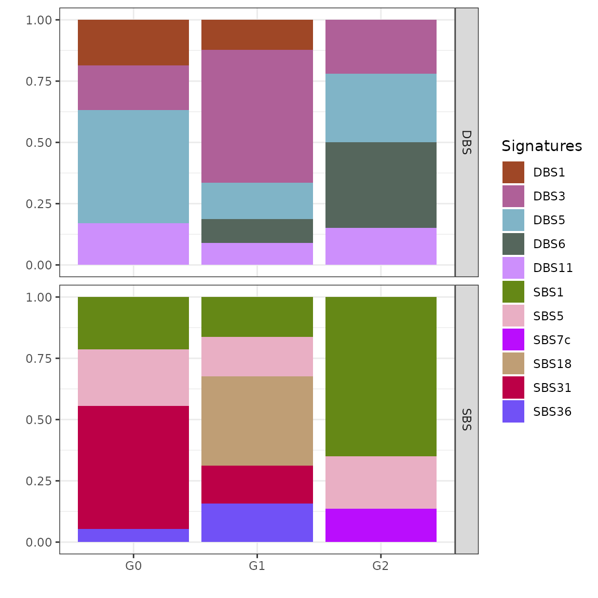
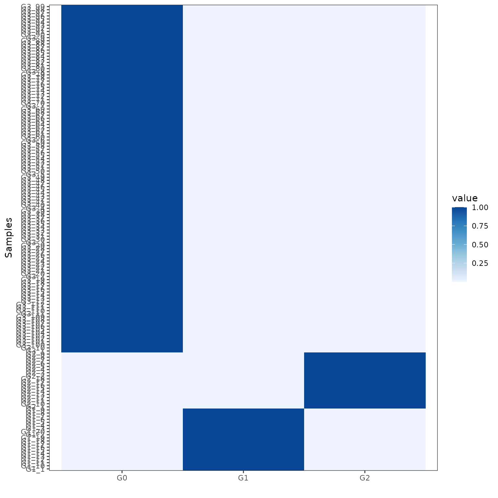

# Inference with BASCULE

## BASCULE framework

BASCULE is a framework with two Bayesian models to perform signatures
deconvolution and subsequent exposures clustering.

A Bayesian NMF model is used to deonvolve signatures of any type (SBS,
DBS, ID, etc.).

All inferred exposures, i.e., for each type of signature for which
deconvolution has been executed, are clustered with a Bayesian Dirichlet
Process mixture model, to group patients based on signatures activities
and related mutational processed.

In addition to this, we developed two heuristics to improve the
extracted de novo signatures and the identified clusters.

The recommended workflow of BASCULE is represented in a schematic way in
the following figure and explained in more details in this article.



BASCULE recommended workflow

### Load package

The first required step is to load `bascule`.

``` r
library(bascule)
```

`bascule` Bayesian models are implemented in Python using the Pyro
probabilistic programming language and thus require a working Python
programme and `pybasilica` package. We recommend reading the [Get
Started](https://caravagnalab.github.io/bascule/articles/bascule.html)
article to correctly install the Python package.

``` r
knitr::opts_chunk$set(warning = FALSE, message = FALSE)
reticulate::install_python(version="3.9.16")
reticulate::py_install(packages="pybascule", 
                       pip=TRUE,
                       python_version="3.9.16")
py = reticulate::import("pybascule")
```

### Load the dataset

We can load the data `example_dataset`, a BASCULE object containing the
true signatures and exposures used to generate the mutation counts
matrix. In the object, data for SBS and DBS is reported.

``` r
data("synthetic_data")
```

We can extract the mutation count matrix from the object using the
`get_input` function. With `reconstructed=FALSE` we are obtaining the
observed counts, and not the reconstructed ones computed as the matrix
multiplication of exposures and signatures.

``` r
counts = synthetic_data$counts
head(counts[["SBS"]][, 1:5])
#>      A[C>A]A A[C>A]C A[C>A]G A[C>A]T A[C>G]A
#> G1_1     118       7       0      52      10
#> G1_2     236      21       5     107      17
#> G1_3     132       8       1      50      11
#> G1_4     116      15       3      40      10
#> G1_5     149      12       3      56      10
#> G1_6     161      10       2      66      13
head(counts[["DBS"]][, 1:5])
#>      AC>CA AC>CG AC>CT AC>GA AC>GG
#> G1_1     5     1     4     8     4
#> G1_2     4     1     6     4     3
#> G1_3     5     0     4     6     1
#> G1_4     2     0     0     2     0
#> G1_5     4     0     4     3     0
#> G1_6     0     0     3     1     0
```

We use as reference the COSMIC catalogue for SBS and DBS.

``` r
reference_cat = list("SBS"=COSMIC_sbs_filt, "DBS"=COSMIC_dbs)
head(reference_cat[["SBS"]][1:5, 1:5])
#>         A[C>A]A     A[C>A]C    A[C>A]G     A[C>A]T     A[C>G]A
#> SBS1 0.00000000 0.000000000 0.00000000 0.000000000 0.000000000
#> SBS2 0.00000000 0.000000000 0.00000000 0.000000000 0.000000000
#> SBS3 0.02080832 0.016506603 0.00175070 0.012204882 0.019707883
#> SBS4 0.04219650 0.033297236 0.01559870 0.029497552 0.006889428
#> SBS5 0.01199760 0.009438112 0.00184963 0.006608678 0.010097980
```

In the example dataset, the true number of signatures (reference plus de
novo) is 5 for both SBS and DBS, thus we can provide as list of K de
novo signatures to test values from 0 to 7.

``` r
k_list = 0:7
```

### Fit the model

Now, we can fit the model. Let’s first fit the NMF to perform signatures
deconvolution.

``` r
x = fit(counts=counts, k_list=k_list, n_steps=3000,
        reference_cat=reference_cat,
        keep_sigs=c("SBS1","SBS5"), # force fixed signatures
        store_fits=TRUE, 
        py=py)
```

#### Visualize the inference scores

You can inspect the model selection procedure. The plot shows for each
tested value of K (i.e., number of de novo signatures), the value of the
BIC and likelihood of the respective model. In our implementation, the
model with lowest BIC is considered as the best model.

``` r
plot_scores(x)
```



Another variable of interest is the evolution over the iterations of the
norms of the gradients for each inferred parameter. A good result, as
shown below, is when the norms decreases with inference, reporting an
increased stability.

``` r
plot_gradient_norms(x)
```



#### Visualize the inferred parameters

You can visualize the inferred signatures. Here, we notice that from 41
and 20 SBS and DBS signatures, the model only selects 6 and 5 signatures
from the catalogue. Moreover, it also infers a denovo signature from the
SBS counts.

``` r
plot_signatures(x)
```



### Post fit heuristics and clustering

We can notice from the signatures plots a clear similarity between
signature SBSD1 and SBS31. We can compute a linear combination on de
novo signatures to remove those similar to reference ones.

``` r
x_refined = refine_denovo_signatures(x)
```

On the refined set of signatures we can run the model to perform
clustering of samples based on exposures.

``` r
x_refined_cluster = fit_clustering(x_refined, cluster=3)
```

Here, BASCULE identifies 3 clusters. The last optional but recommended
step, is to run the function
[`merge_clusters()`](https:%3A/caravagnalab.github.io/bascule/reference/merge_clusters.md).
The function has two inputs, a BASCULE object `x` and a cosine
similarity cutoff `cutoff`, which specifies the minimum cosine
similarity between cluster centroids required for merging. The default
value for the cosine similarity cutoff is 0.8.

``` r
x_refined_cluster = merge_clusters(x_refined_cluster)
```

In this case, no clusters are merged, in fact the new object has 3
clusters.

### Visualisation of the results

#### Mutational signatures

The post-fit de novo signatures refinement discarded signature SBSD1,
since it showed high similarity with reference signature SBS31.

``` r
plot_signatures(x_refined_cluster)
```



#### Exposures matrix

We can visualise the exposures for each patient divided by final group
assignment. In this case, BASCULE retrieved 3 groups. Each cluster is
characterised by a set of SBS and DBS. For instance, group G0 is the
largest one and is characterised by signatures DBS1, DBS11 and DBS3, and
SBS1, SBS5 and SBS31.

``` r
plot_exposures(x_refined_cluster)
```



#### Clustering centroids

We can also inspect the inferred clustering centroids, reporting for
each cluster an average of the group-specific signatures exposures.

``` r
plot_centroids(x_refined_cluster)
```



#### Posterior probabilities

We can finally visualise the posterior probabilities for each sample’s
assignment. Each row (samples) of this heatmap sums to 1 and reports the
posterior probabilities for each sample to be assigned to each cluster
(columns).

``` r
plot_posterior_probs(x_refined_cluster)
```


