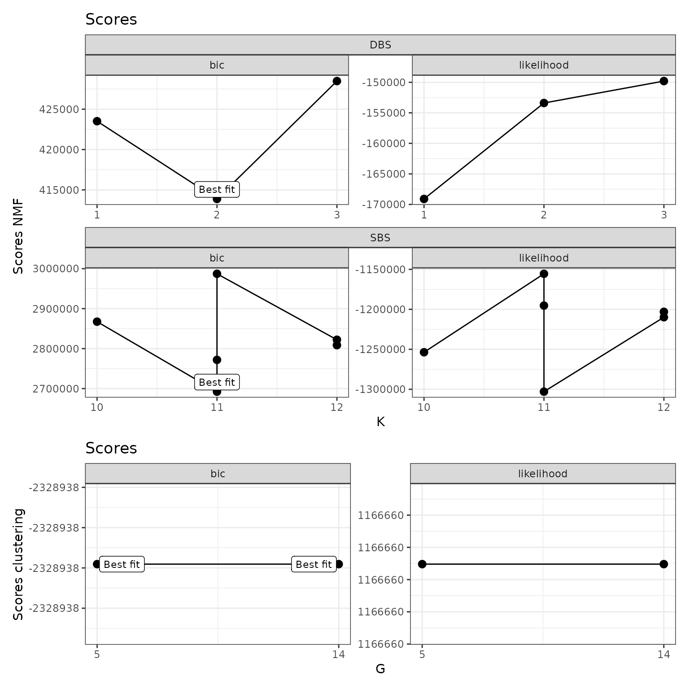
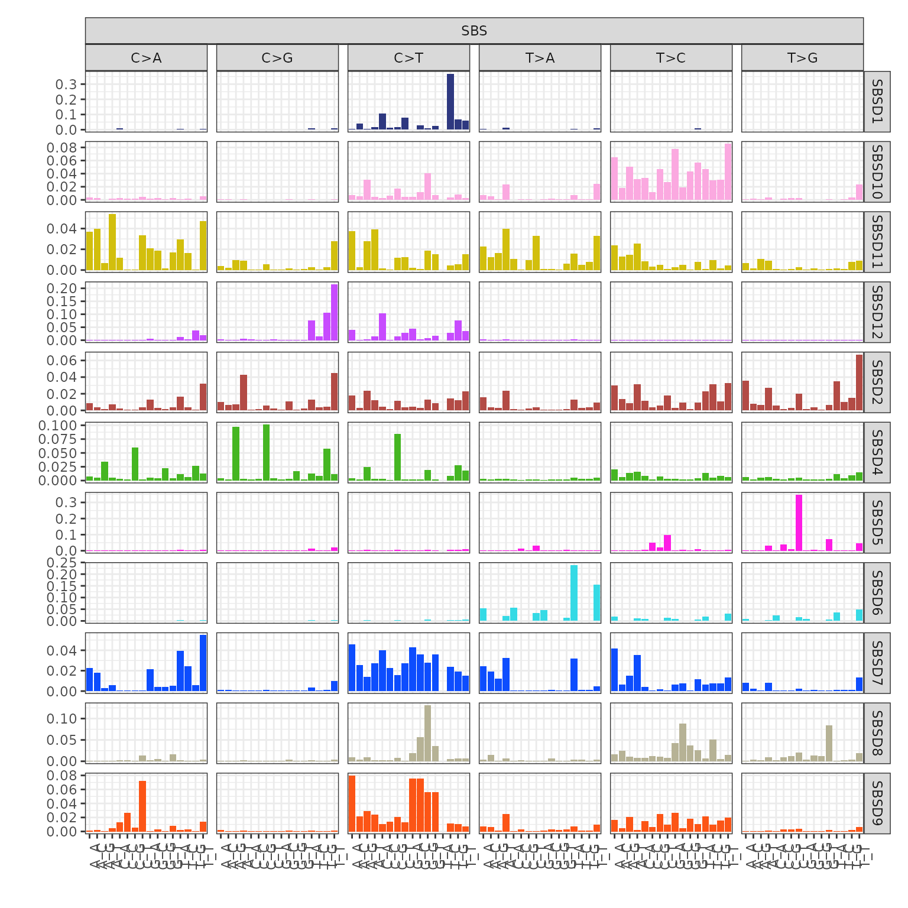
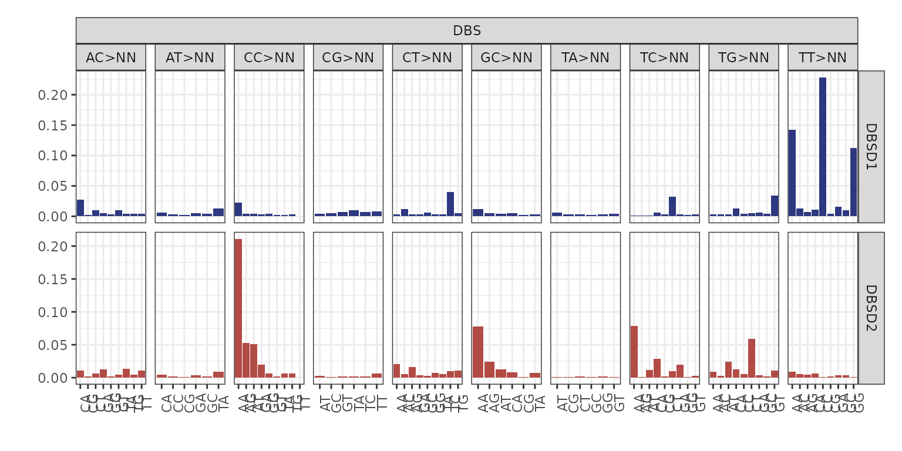
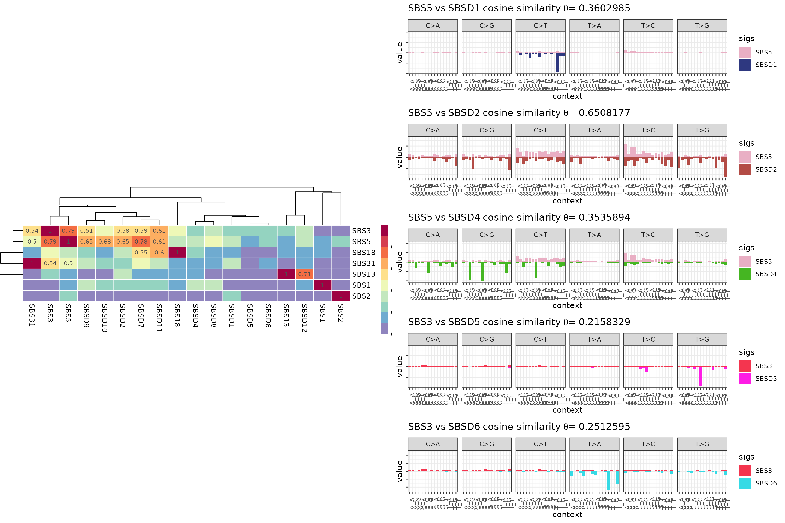
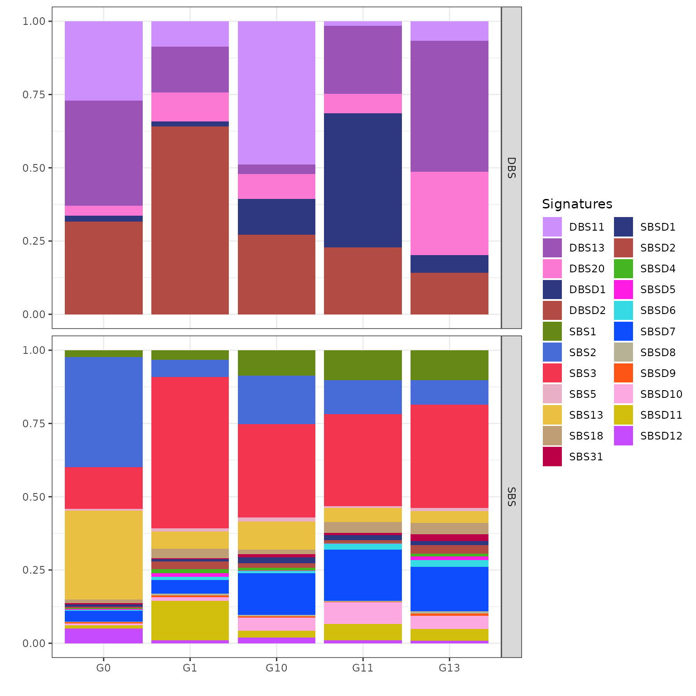
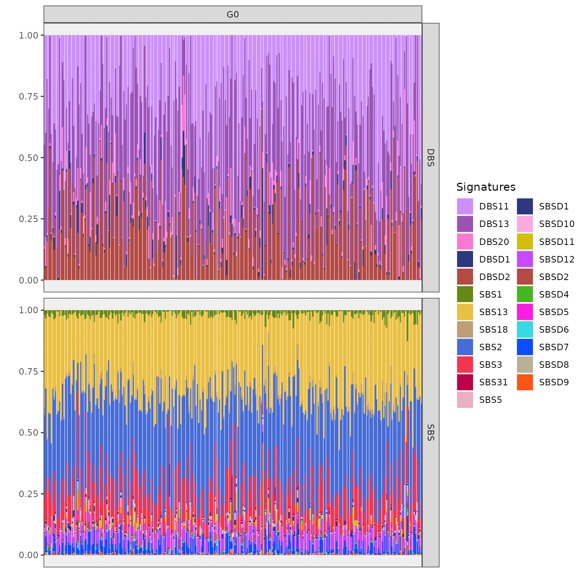
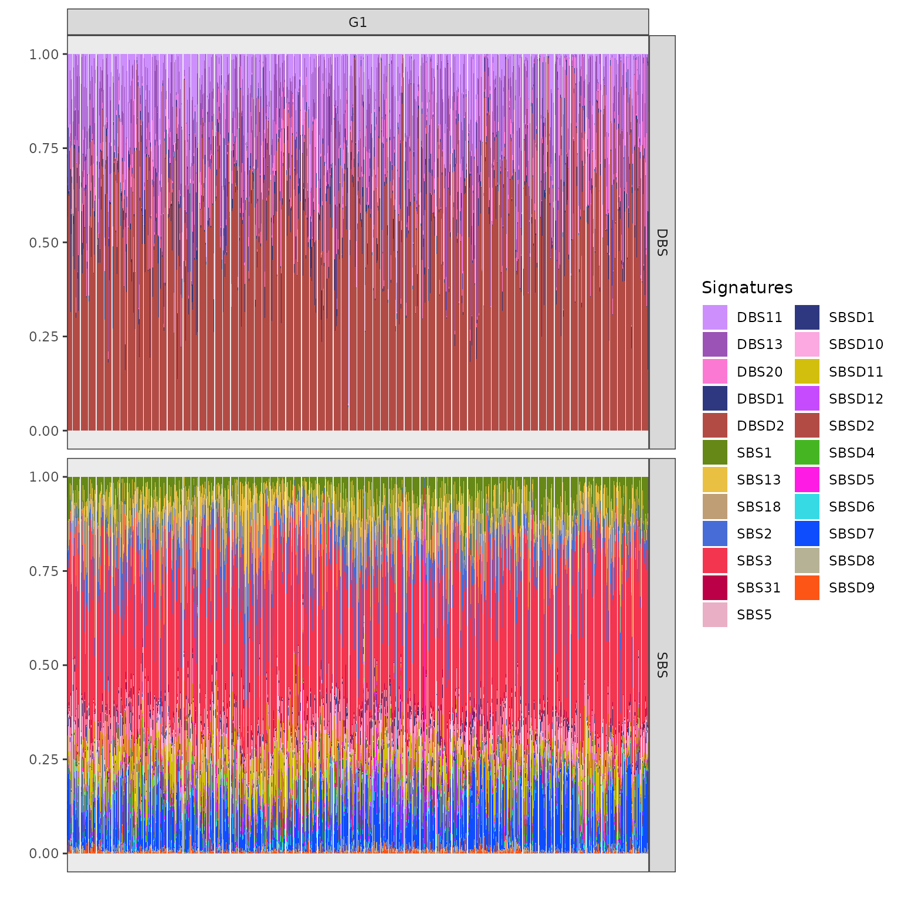
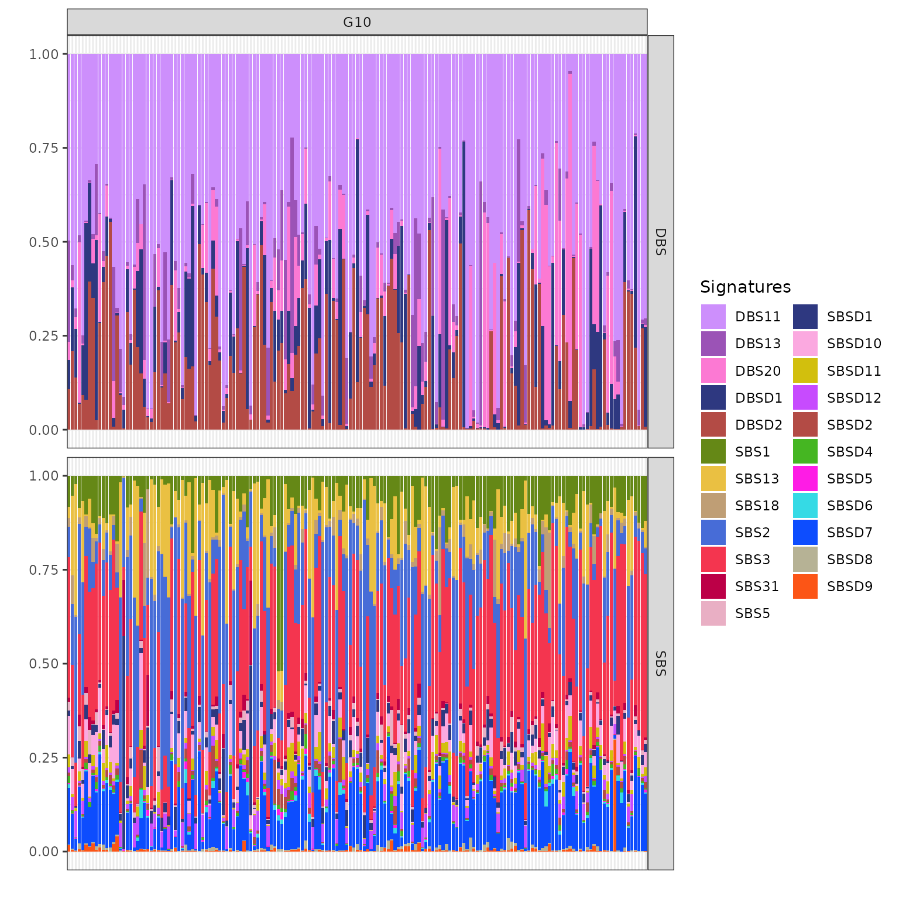
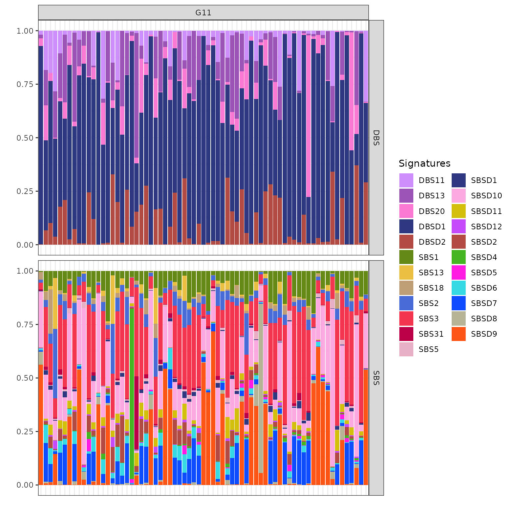
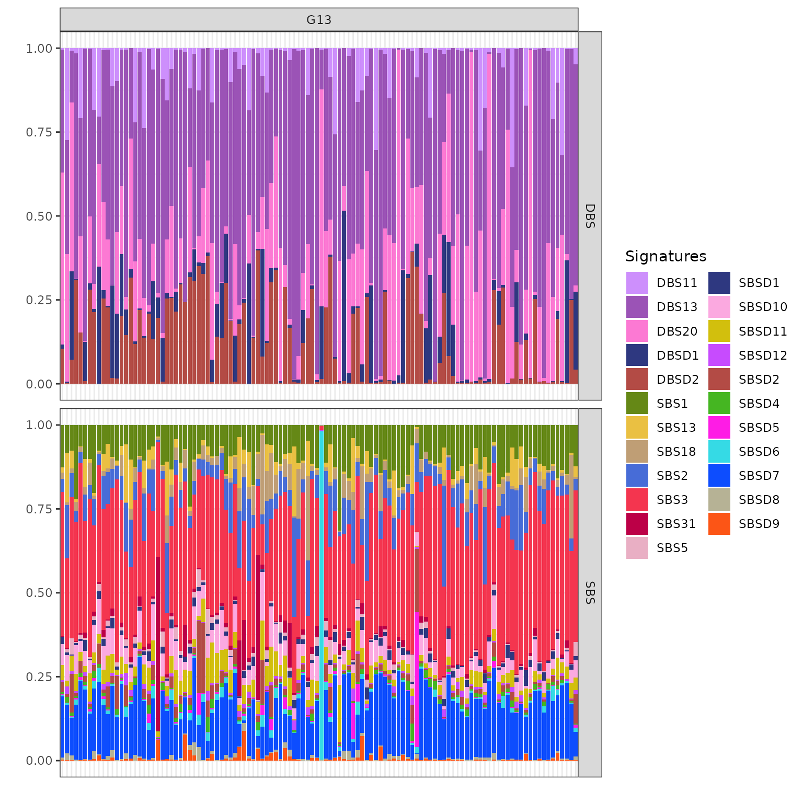

# Real data analysis on a breast cancer cohort

## Package setup

For detailed explanation, please visit the [package
setup](https://caravagnalab.github.io/bascule/articles/bascule.html).

``` r
knitr::opts_chunk$set(warning=FALSE, message=FALSE)

reticulate::conda_create(envname="bascule", python_version="3.10")
reticulate::use_condaenv("bascule")
reticulate::conda_install(envname="bascule", packages="pybascule", pip=TRUE)
```

``` r
library(bascule)
#> ✔ Loading bascule. Support : <https://caravagnalab.github.io/bascule/>
```

## Data

We want to analyze 2,682 breast tumour samples from the GEL, ICGC, and
HMF cohorts. For this purpose We load the breast tumor type data object
`breast_data` (for more details visit
[here](https://caravagnalab.github.io/bascule/reference/breast_data.html))
from the bascule package, and retrieve the input data (`counts`) from
it.

The `counts` object is a list which contains two SBS and DBS matrices
(`data.frame`), both with 2682 rows (representing samples), and 96
columns for SBS context and 78 columns for DBS context (representing
mutational contexts). The values of the matrices are number of the
mutations for corresponding sample and mutational context. The counts
matrix can extracted from bascule fit object using the `get_input`
function in the package.

``` r
# load breast fit data from package
data("breast_data")

# extract the bascule fit object for breast tumor type
x = breast_data$x

x
#> ── [ Bascule ]   samples with 0 total mutations. ───────────────────────────────
#> 
#> ── SBS catalogue signatures (5 columns shown max)
#>            A[C>A]A     A[C>A]C     A[C>A]G     A[C>A]T     A[C>G]A
#>  SBS1  0.000000000 0.000000000 0.000000000 0.000000000 0.000000000
#>  SBS2  0.000000000 0.000000000 0.000000000 0.000000000 0.000000000
#>  SBS3  0.020808323 0.016506603 0.001750700 0.012204882 0.019707883
#>  SBS5  0.011997600 0.009438112 0.001849630 0.006608678 0.010097980
#>  SBS13 0.000000000 0.000000000 0.000000000 0.000000000 0.000000000
#>  SBS18 0.051533859 0.015810387 0.002431598 0.021414070 0.001731137
#>  SBS31 0.009534985 0.018490274 0.001659127 0.006276698 0.008315626
#> 
#> ── De novo signatures (5 columns shown max)
#>              A[C>A]A     A[C>A]C      A[C>A]G     A[C>A]T      A[C>G]A
#>  SBSD1  0.0013021588 0.001086904 0.0010003703 0.001298402 0.0009850989
#>  SBSD2  0.0086599355 0.003850128 0.0019153069 0.007406929 0.0097875630
#>  SBSD4  0.0071512359 0.005733336 0.0339316145 0.004755269 0.0046120340
#>  SBSD5  0.0027345754 0.002193904 0.0007122308 0.002187520 0.0017807318
#>  SBSD6  0.0021000142 0.001562314 0.0009072816 0.001607518 0.0012848607
#>  SBSD7  0.0225498791 0.017800982 0.0031354088 0.006062250 0.0009157615
#>  SBSD8  0.0008454395 0.000797856 0.0004881849 0.001464493 0.0012844335
#>  SBSD9  0.0010254879 0.001912371 0.0003545345 0.004855627 0.0018162442
#>  SBSD10 0.0035070582 0.002635648 0.0003777245 0.002224826 0.0006770983
#>  SBSD11 0.0369320129 0.039624678 0.0067355421 0.053949864 0.0037204620
#>  SBSD12 0.0012540791 0.001046035 0.0008772321 0.001602001 0.0031040453
#> 
#> ── DBS catalogue signatures (5 columns shown max)
#>              AC>CA       AC>CG       AC>CT       AC>GA       AC>GG
#>  DBS11 0.001369907 0.000193987 0.000755948 0.000441970 0.002249847
#>  DBS13 0.002155121 0.000051500 0.002853398 0.002762299 0.001464314
#>  DBS20 0.005031140 0.001909180 0.002372220 0.001585940 0.002634990
#> 
#> ── De novo signatures (5 columns shown max)
#>             AC>CA       AC>CG       AC>CT       AC>GA       AC>GG
#>  DBSD1 0.02705068 0.002431567 0.009581317 0.004772051 0.003079476
#>  DBSD2 0.01119519 0.001638339 0.005947791 0.012590619 0.001679650
```

``` r
# retrieve the input data of the breast tumor type
counts = get_input(x, matrix=TRUE, reconstructed=FALSE)

# dimensions of SBS and DBS count matrices
dim(counts[["SBS"]])
#> [1] 2682   96
dim(counts[["DBS"]])
#> [1] 2682   78

# display first 5 rows and first 5 columns of SBS and DBS matrices
head(counts[["SBS"]][1:5, 1:5])
#>                A[C>A]A A[C>A]C A[C>A]G A[C>A]T A[C>G]A
#> GEL-2474917-11     131      81      11      70      71
#> GEL-2516072-11     279     199      32     202      68
#> GEL-2905314-11      54      54      11      38      20
#> GEL-2464811-11      48      36       5      35      17
#> GEL-2142020-11      33      18       7      16       8
head(counts[["DBS"]][1:5, 1:5])
#>                AC>CA AC>CG AC>CT AC>GA AC>GG
#> GEL-2474917-11     0     0     0     0     0
#> GEL-2516072-11     1     0     0     1     0
#> GEL-2905314-11     0     0     0     0     0
#> GEL-2464811-11     0     0     0     1     0
#> GEL-2142020-11     0     0     0     0     0
```

As a reference catalogue for breast cancer, we selected signatures SBS1,
SBS2, SBS3, SBS5, SBS13, SBS17, SBS18, SBS31, for SBS context and
signatures DBS11, DBS13, and DBS20, for the DBS context.

These signature collections are a subset of the
[COSMIC_sbs_filt](https://caravagnalab.github.io/bascule/reference/COSMIC_sbs_filt.html)
and
[COSMIC_dbs](https://caravagnalab.github.io/bascule/reference/COSMIC_dbs.html)
catalogues.

Based on prior biological knowledge we expect to see the SBS3 as one of
the signatures included in both matrices, but in practice, the SBS3
signature is not present in the output of the model. Here we give higher
weights to SBS3 using `hyperparameters` arguments (visit
[here](https://caravagnalab.github.io/bascule/reference/fit.html) for
more information), to keep this signature in final output.

``` r
reference_cat = list(
  "SBS" = COSMIC_sbs_filt[c("SBS1", "SBS2", "SBS3", "SBS5", "SBS13", "SBS17b", "SBS18", "SBS31"), ], 
  "DBS" = COSMIC_dbs[c("DBS11", "DBS13", "DBS2"), ]
)

alpha_conc = list("SBS3"=100)
```

## Fit the model

We run the model by executing the `fit` function from bascule package
which performs the non-negative matrix factorization to deconvolute the
counts matrix to lower rank matrices.
[fit](https://caravagnalab.github.io/bascule/reference/fit.html). The
analysis identified 19 SBS (12 de novo) and 5 DBS (2 de novo)
signatures. we aim to eliminate any inferred de novo signatures that can
be represented as a linear combination of other signatures. This is done
using the `refine_denovo_signatures` function, applied to the bascule
object. After a refinement step, one de novo signature from SBS context
was removed due to its explainability by other signatures. we identified
18 SBS (11 de novo) and 5 DBS (2 de novo) signatures after refinement.

We use the `fit_clustering` function from the bascule package on the
bascule object generated from the refinement step. we proceeded with the
merging step and the tool detected 14 clusters among the breast cancer
samples. As we saw in re-clustering step, the tool detected 14 clusters
among the breast cancer samples. We then applied an iterative merging
function, resulting in 5 clusters, using a cutoff value of 0.8.

Later, with help of `convert_dn_names` function we map the de novo
signatures to known signatures from the COSMIC catalogue and the
findings from Degasperi et al. within the SBS context, 6 de novo
signatures corresponded to COSMIC signatures SBS7a, SBS17b, SBS26,
SBS40a, SBS90, and SBS98. Additionally, one de novo signature aligned
with the common signature SBS8, and two signatures matched rare
signatures SBS44 and SBS97, both from the Degasperi et al. study. In the
DBS context, we mapped two de novo signatures to COSMIC signatures DBS14
and DBS20.

## Visualization

The bascule object obtained from the previous steps is ready for
visualization step. all the visualization functions take the bascule
object as the input.

### Fitting scores

The `plot_scores` visualize the model selection steps. The plot display
the BIC and likelihood scores of NMF run for each k value (number of de
novo signatures) for both SBS and DBS context. In the plot, the `x` axis
is related to k values and the `y` axis is related to scores (BIC and
Likelihood). The model selects the k value with lowest BIC score in
iterative inference process.

``` r
plot_scores(x)
```



Based on the BIC score, the model with 11 de novo signatures for SBS and
2 de novo signatures for DBS provides the best fit compared to all other
models.

### Mutational signatures

We utilize the `plot_signatures` function to visualize the mutational
signatures inferred by the model. The `types` and `signames` arguments
allow us to specify the context type and the list of signatures to plot.
The `get_denovo_signames` function is used to obtain the list of de novo
signature names. Each plot consist of multiple signatures plot with
their name on the right hand side.

``` r
plot_signatures(x, types="SBS", signames=get_denovo_signames(x))
```



The plot above shows 11 de novo signatures inferred by the tool in SBS
context. The `x` axis shows the 96 possible SBS contexts and the `y`
axis declare their respective density.

``` r
plot_signatures(x, types="DBS", signames=get_denovo_signames(x))
```



The plot above shows 2 de novo signatures inferred by the tool in DBS
context. The `x` axis shows the 78 possible DBS contexts and the `y`
axis declare their respective density.

### Similarity plot

Function `plot_similarity_reference` plots the similarity between de
novo and COSMIC signatures based on cosine similarity values.

``` r
plot_similarity_reference(x)
```



The heatmap plot inspects the similarities between the de novo and
COSMIC signatures. The rows are de novo signatures, columns are COSMIC
signatures and the values are cosine similarity between the
corresponding signatures.

### Clusters centroids

The
[`plot_centroids()`](https:%3A/caravagnalab.github.io/bascule/reference/plot_centroids.md)
function is used to plot the clustering centroids.

Here, we visualize the clustering centroids of mutational signatures
clusters. This plot provides a clear representation of how the
mutational signatures are grouped based on their similarities. The
`plot_centroids` function is used to generate this visualization,
offering insight into the relationships and distances between different
mutational signatures. By examining this plot, we can better understand
the patterns and structure of the signature clustering results.

``` r
plot_centroids(x)
```



You can inspect the centroids for each cluster in two SBS and DBS
context. the `x` axis defines the clusters, the `y` axis defines the
density of signatures and the colors represent the signatures which are
present in the clusters. Using the centroids we can analyze the patients
clustering outcome. For detailed information we can follow the exposure
plots of each cluster to find out the clustering logic and possible
etiology behind it.

### Exposures matrix

The `plot_exposures` function is used to visualize the inferred exposure
matrix, where `x` axis represent samples, `y` axis represents the
mutational signatures relative contributions and the colors identify the
mutational signatures. The exposure matrix displays the contribution of
each mutational signature across different samples. This plot provides a
clear overview of how different mutational signatures contribute to the
overall mutational profile across the dataset. For clearer
visualization, we plot the exposure matrix for each cluster separately.
The `clusters` argument is used to specify which cluster to plot.

``` r
plot_exposures(x, clusters=c("G0"))
```



In the exposure plot for cluster G0 (n=272), the dominant mutational
signatures are SBS2 and SBS13, along with DBS11, DBS13, and DBSD2
(mapped to DBS2 from COSMIC). These signatures are associated with
APOBEC enzyme activity. APOBEC-driven mutational processes are
frequently observed in HER2-positive breast cancers, suggesting a strong
link between this cluster and HER2-driven tumorigenesis.

``` r
plot_exposures(x, clusters=c("G1"))
```



The cluster G1 (n=2058) exposure plot, which is the largest among all,
shows a strong presence of SBS3, SBSD11 (mapped to SBS8 from Degasperi
et al.), DBSD2 (mapped to DBS2 from COSMIC) and DBS13. SBS3 and DBS13
are caused by homologous recombination deficiency (HRD); DBS2, instead,
is linked to smoking in some cancers but is often observed also in
cancers not directly linked with tobacco exposure. Based on these
prevalent signatures, cluster G1 can be associated with triple-negative
breast cancers.

Clusters G10 (n=169), G11 (n=69), and G13 (n=114) share similar SBS
patterns, including exposure to SBS1, SBS2, SBS3, SBS11, and SBS13,
pointing to a mix of APOBEC activity, HRD, and ageing-related mutational
processes. BASCULE can differentiate these three clusters based on DBS
exposure.

``` r
plot_exposures(x, clusters=c("G10"))
```



Cluster G10 is notably associated with the mutational signatures DBSD2
(mapped to DBS2 from COSMIC) and DBS11. These signatures are linked to
the activity of the APOBEC enzyme family. The strong link between G10
and these signatures suggests that APOBEC activity may be a driving
factor behind the mutational processes in this cluster.

``` r
plot_exposures(x, clusters=c("G11"))
```



The cluster G11 as the smallest cluster is primarily exposed to DBSD1
(mapped to DBS14 from COSMIC), a signature reported as artifactual in
COSMIC. However, the presence of DBS13 in G11, suggests that this
cluster is also linked to homologous recombination deficiency (HRD).

``` r
plot_exposures(x, clusters=c("G13"))
```



Cluster G13 shows significant exposure to the mutational signatures
DBS13 and DBS20. These particular signatures are associated with
homologous recombination deficiency (HRD)-related processes. The
presence of DBS13 and DBS20 in cluster G13 suggests that the samples in
this group may be influenced by similar underlying genomic instability
and repair deficiencies.
