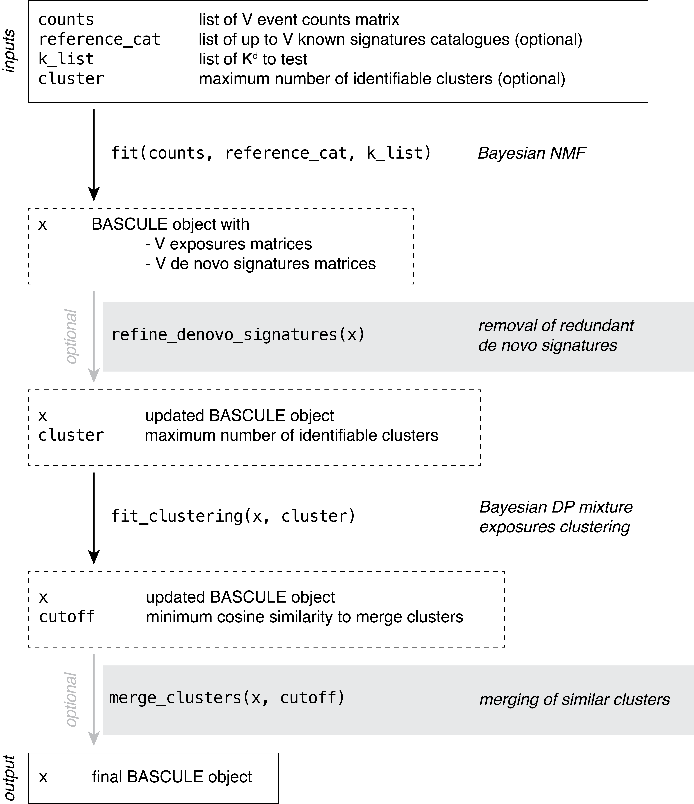

```{r, include = FALSE}
knitr::opts_chunk$set(
  collapse = TRUE,
  comment = "#>"
)
```


## BASCULE framework

BASCULE is a framework with two Bayesian models to perform signatures deconvolution and subsequent exposures clustering. 

A Bayesian NMF model is used to deonvolve signatures of any type (SBS, DBS, ID, etc.). 

All inferred exposures, i.e., for each type of signature for which deconvolution has been executed, are clustered with a Bayesian Dirichlet Process mixture model, to group patients based on signatures activities and related mutational processed. 

In addition to this, we developed two heuristics to improve the extracted de novo signatures and the identified clusters.

The recommended workflow of BASCULE is represented in a schematic way in the following figure and explained in more details in this article.

{#id .class width=50% height=50%}


### Load package 

The first required step is to load `bascule`.
```{r message=FALSE, warning=FALSE}
library(bascule)
```

`bascule` Bayesian models are implemented in Python using the Pyro probabilistic programming language and thus require a working Python programme and `pybasilica` package. We recommend reading the [Get Started](https://caravagnalab.github.io/bascule/articles/bascule.html) article to correctly install the Python package.

```{r setup, eval=FALSE, warning=FALSE, message=FALSE}
knitr::opts_chunk$set(warning = FALSE, message = FALSE)
reticulate::install_python(version="3.9.16")
reticulate::py_install(packages="pybascule", 
                       pip=TRUE,
                       python_version="3.9.16")
py = reticulate::import("pybascule")
```


### Load the dataset

We can load the data `example_dataset`, a BASCULE object containing the true signatures and exposures used to generate the mutation counts matrix. In the object, data for SBS and DBS is reported.
```{r}
data("synthetic_data")
```

We can extract the mutation count matrix from the object using the `get_input` function. With `reconstructed=FALSE` we are obtaining the observed counts, and not the reconstructed ones computed as the matrix multiplication of exposures and signatures.

```{r}
counts = synthetic_data$counts
head(counts[["SBS"]][, 1:5])
head(counts[["DBS"]][, 1:5])
```

We use as reference the COSMIC catalogue for SBS and DBS.

```{r}
reference_cat = list("SBS"=COSMIC_sbs_filt, "DBS"=COSMIC_dbs)
head(reference_cat[["SBS"]][1:5, 1:5])
```

In the example dataset, the true number of signatures (reference plus de novo) is 5 for both SBS and DBS, thus we can provide as list of K de novo signatures to test values from 0 to 7.

```{r}
k_list = 0:7
```

### Fit the model

Now, we can fit the model. Let's first fit the NMF to perform signatures deconvolution. 
```{r eval=FALSE}
x = fit(counts=counts, k_list=k_list, n_steps=3000,
        reference_cat=reference_cat,
        keep_sigs=c("SBS1","SBS5"), # force fixed signatures
        store_fits=TRUE, 
        py=py)
```

```{r include=FALSE}
x = synthetic_data$x
```

#### Visualize the inference scores

You can inspect the model selection procedure. The plot shows for each tested value of K (i.e., number of de novo signatures), the value of the BIC and likelihood of the respective model. In our implementation, the model with lowest BIC is considered as the best model.

```{r message=FALSE, warning=FALSE}
plot_scores(x)
```

Another variable of interest is the evolution over the iterations of the norms of the gradients for each inferred parameter. A good result, as shown below, is when the norms decreases with inference, reporting an increased stability. 

```{r}
plot_gradient_norms(x)
```


#### Visualize the inferred parameters

You can visualize the inferred signatures. Here, we notice that from `r nrow(COSMIC_sbs_filt)` and `r nrow(COSMIC_dbs)` SBS and DBS signatures, the model only selects `r length(get_fixed_signames(x)$SBS)` and  `r length(get_fixed_signames(x)$DBS)` signatures from the catalogue. Moreover, it also infers a denovo signature from the SBS counts.

```{r fig.height=10, fig.width=12, message=FALSE, warning=FALSE}
plot_signatures(x)
```


### Post fit heuristics and clustering

We can notice from the signatures plots a clear similarity between signature SBSD1 and SBS31. 
We can compute a linear combination on de novo signatures to remove those similar to reference ones.

```{r eval=FALSE}
x_refined = refine_denovo_signatures(x)
```

On the refined set of signatures we can run the model to perform clustering of samples based on exposures.

```{r eval=FALSE}
x_refined_cluster = fit_clustering(x_refined, cluster=3)
```

```{r include=FALSE}
x_refined_cluster = synthetic_data$x_refined_cluster
```

Here, BASCULE identifies `r get_n_groups(x_refined_cluster)` clusters. The last optional but recommended step, is to run the function `merge_clusters()`. The function has two inputs, a BASCULE object `x` and a cosine similarity cutoff `cutoff`, which specifies the minimum cosine similarity between cluster centroids required for merging. The default value for the cosine similarity cutoff is 0.8.

```{r}
x_refined_cluster = merge_clusters(x_refined_cluster)
```

In this case, no clusters are merged, in fact the new object has `r get_n_groups(x_refined_cluster)` clusters.

### Visualisation of the results

#### Mutational signatures

The post-fit de novo signatures refinement discarded signature SBSD1, since it showed high similarity with reference signature SBS31.

```{r fig.height=10, fig.width=12, message=FALSE, warning=FALSE}
plot_signatures(x_refined_cluster)
```


#### Exposures matrix

We can visualise the exposures for each patient divided by final group assignment.
In this case, BASCULE retrieved 3 groups. Each cluster is characterised by a set of SBS and DBS. For instance, group G0 is the largest one and is characterised by signatures DBS1, DBS11 and DBS3, and SBS1, SBS5 and SBS31.

```{r fig.height=6, fig.width=12, message=FALSE, warning=FALSE}
plot_exposures(x_refined_cluster)
```

#### Clustering centroids

We can also inspect the inferred clustering centroids, reporting for each cluster an average of the group-specific signatures exposures.

```{r fig.height=6, fig.width=6, message=FALSE, warning=FALSE}
plot_centroids(x_refined_cluster)
```

#### Posterior probabilities

We can finally visualise the posterior probabilities for each sample's assignment. Each row (samples) of this heatmap sums to 1 and reports the posterior probabilities for each sample to be assigned to each cluster (columns).

```{r fig.height=8, fig.width=8, message=FALSE, warning=FALSE}
plot_posterior_probs(x_refined_cluster)
```

